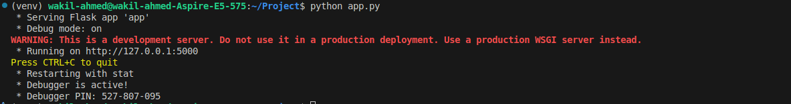
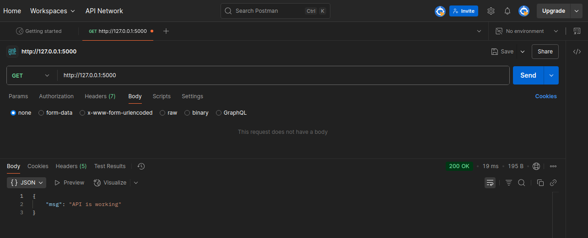
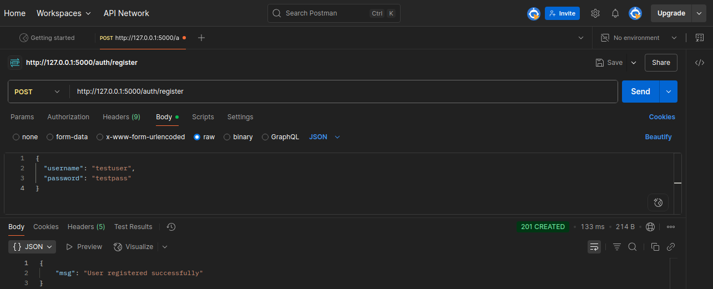
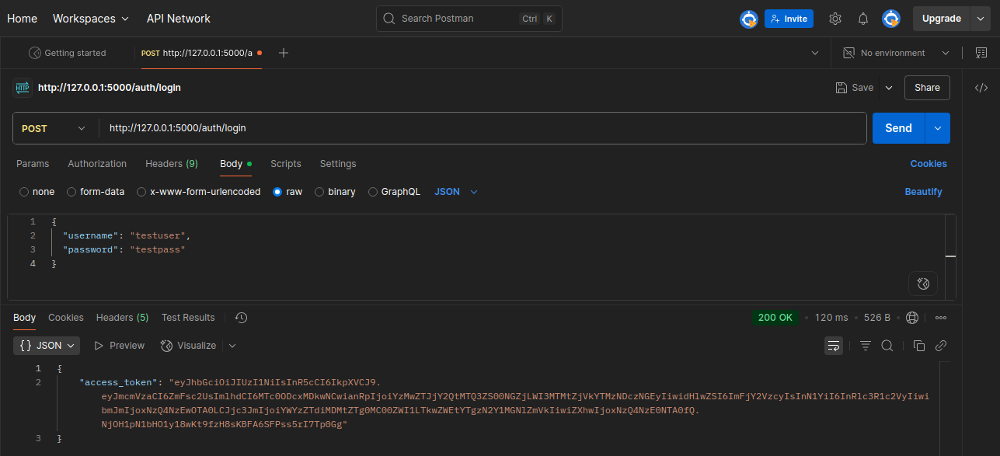
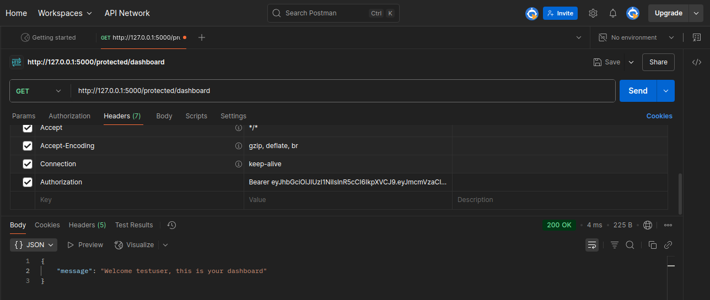
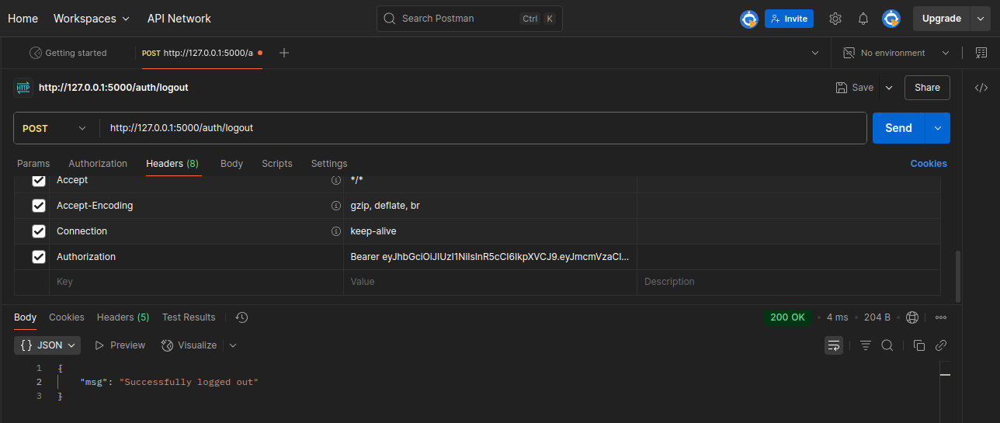

# Flask JWT Authentication with PostgreSQL
This repository contains a secure Flask API implementing JWT (JSON Web Tokens) based authentication using a PostgreSQL database. It's designed to be set up and run directly on your system, providing a backend for user management and protected resource access.

---
# Project Diagram


# JWT Authorization Overview
JWT (JSON Web Token) is a compact, URL-safe means of representing claims between two parties. In this project, JWT is used for secure user authentication and authorization. After a successful login, the server generates a token that encodes the user's identity and permissions. This token is sent to the client and must be included in subsequent requests to access protected routes. The server validates the token to authorize access, ensuring stateless and secure communication between client and server.


##  Project Structure

```
Project/
│
├── app.py
├── routes/
│   ├── auth_routes.py
│   └── protected_routes.py
├── extensions.py
├── config.py
├── models.py
├── requirements.txt
└── README.md
```


#  Setup Instructions


## 1. Database setup

### Install PostgreSQL
```bash
sudo apt update
sudo apt install postgresql postgresql-contrib libpq-dev build-essential
```
### Active PosrgreSQL Database
```bash
sudo systemctl start postgresql
```
### Access PostgreSQL as the ```postgres``` user:
```bash
sudo -i -u postgres
psql
```
You should now be at the ```postgres=#``` prompt.

### Create your database
```bash
CREATE DATABASE flask_jwt_db;
```
### Create database user
```bash
CREATE USER poridhi WITH PASSWORD 'poridhi1234';
```
### Grant privilage to user
```bash
GRANT ALL PRIVILEGES ON DATABASE flask_jwt_db TO poridhi;
```
### Grant schema-level privilage 
```bash
\c flask_jwt_db; # Connect to your new database first
GRANT CREATE ON SCHEMA public TO poridhi;
```
- This allows ```poridhi``` to create tables within the ```public``` schema.

### Exit ```psql``` and the ```postgres``` user session:
```bash
\q
exit
```


## 2. Clone the Repository

```bash
git clone https://github.com/wakil86/Flask_JWT_postgresql.git
cd Flask_JWT_postgresql
```

## 3. Create & activate Python environment

```bash
python3 -m venv venv
source venv/bin/activate
```
### 4. Install Python dependencies
```bash
pip install -r requirements.txt
```
### 5. Run the Flask app
```bash
python app.py
```
### Expected output


##  Testing API Endpoints (via Postman)


### Home 
```
GET http://127.0.0.1:5000
```
### Expected output


###  Registration

```
POST http://127.0.0.1:5000/auth/register
{
  "username": "testuser",
  "password": "testpass"
}
```
### Expected output


###  Login

```
POST http://127.0.0.1:5000/auth/login
{
  "username": "testuser",
  "password": "testpass"
}
```
### Expected output


###  Protected Route

```
GET http://127.0.0.1:5000/protected/dashboard
Headers:
  Authorization: Bearer <JWT_TOKEN>
```
### Expected output


###  Logout

```
POST /auth/logout
Headers:
  Authorization: Bearer <JWT_TOKEN>
```
### Expected output

---


##  Testing API Endpoints (via terminal)

###  Registration

```
curl -X POST http://127.0.0.1:5000/auth/register \
-H "Content-Type: application/json" \
-d '{"username": "testuser", "password": "testpass"}'
```
### output

```
{"msg":"User registered successfully"}
```
### Login

```
curl -X POST http://127.0.0.1:5000/auth/login \
-H "Content-Type: application/json" \
-d '{"username": "testuser", "password": "testpass"}'
```
### Output
```
{"access_token": "<JWT_TOKEN_HERE>"}
```
### Protected Login
```
curl -X GET http://127.0.0.1:5000/protected/dashboard \
-H "Authorization: Bearer <JWT_TOKEN_HERE>"

```
### Output
```
{"message":"Welcome testuser, this is your dashboard"}
```
### Logout
```
curl -X POST http://127.0.0.1:5000/auth/logout \
-H "Authorization: Bearer <JWT_TOKEN_HERE>"
```
### Output
```
{"msg":"Successfully logged out"}
```

##  License

This project is licensed under the MIT License. See the [LICENSE](LICENSE) file for details.

---

