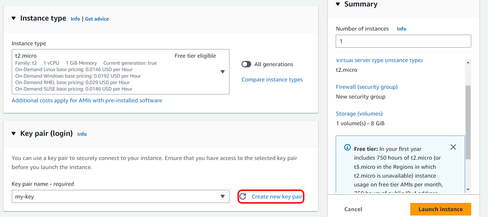
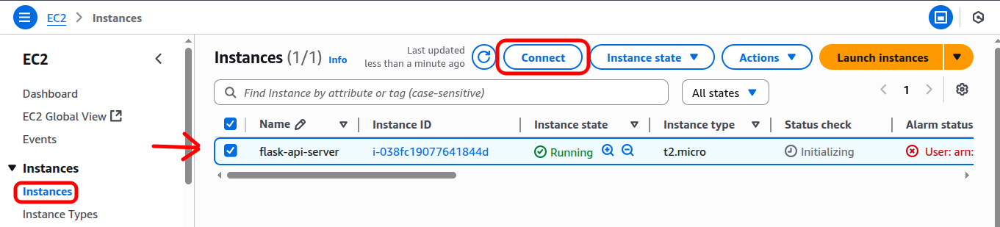

# Flask JWT PostgreSQL API Deployment on AWS EC2 (within a Custom VPC)

## 1. Overview & Learning Objectives

This guide will walk you through the process of deploying a Flask JWT PostgreSQL API on an AWS EC2 instance. Crucially, this guide emphasizes setting up the EC2 instance within a custom Virtual Private Cloud (VPC) from scratch. You will do that with a structured and isolated network environment using docker.

### By the end of this guide, you will have:

* Created a custom VPC.
* Set up a public subnet within your VPC
* Configured an Internet Gateway and attached it to your VPC.
* Set up a route table to enable internet access for your public subnet.
* Launched an Ubuntu EC2 instance in your public subnet.
* Deployed your Flask API, PostgreSQL database, using Docker Compose on the EC2 instance.
* Successfully tested your API endpoints (register, login, protected, logout).

## 2. Project Diagram


## 3. VPC & EC2 Setup:

This section details the initial setup of your network infrastructure (VPC, Subnets, Internet Gateway, Route Tables) and the launch of your EC2 instance.

### Step 1: Create Your VPC

1.  **Log in and search for "VPC" in the search bar.**
2.  **Navigate to "Your VPCs" On the left-hand side, click on "Your VPCs".**
3.  **Find and click the "Create VPC" on the top right corner**
4.  **Name your VPC (e.g `my-flask-api-vpc`).**
    **In IPv4 CIDR block Set this to `10.0.0.0/16`.**
5.  **Click on "Create VPC".**
    

    


### Step 2: Create a Public Subnet

1.  **After creating your VPC, click on "Subnets" on the left-hand side.**
2.  **Click "Create Subnet":**
3.  **From the dropdown, select the VPC you just created.**


4. **From Subnet Settings Name your subnet (e.g `my-subnet`)**
5. **Select availability zone from the dropdown box**
6. **From IPv4 VPC CIDR block select the IP you have assigned in VPC.**
7.  **Assign CIDR Block assign a CIDR block within your VPC’s range (e.g., `10.0.0.0/24`). This will be your public subnet.**
8.   **Click "Create Subnet".**


9.  **Enable Auto-assign Public IP:**
    * Click on the subnet you just created.
    * Go to the "Actions" dropdown, then select "Edit subnet settings".
    * Check the box for "Enable auto-assign public IPv4 address".
    * Click "Save".


 

### Step 3: Create and Attach an Internet Gateway

1.  **On the left-hand side, click on "Internet Gateways".**
2.  **Click "Create internet gateway":**
3.  **Give your IGW a descriptive name (e.g., `my-flask-api-igw`).**
4.  **Click "Create internet gateway".**


5. **Once created, select the IGW.**
6. **Click "Actions" and then "Attach to VPC".**
    


7. **Select your VPC (e.g., `my-flask-api-vpc`) from the dropdown and attach the Internet Gateway.**


### Step 4: Configure Route Tables

1.  **On the left-hand side, click on "Route Tables".**
2.  **Click "Create route table":**


3. **Name your route table (e.g `my-route-table`)**
4. **Associate it with your VPC.**


5.  **Add Route for Internet Access:**
    * Select the newly created route table.
    * Go to the "Routes" tab, then click "Edit routes".
    
    
        
    * Click "Add route".
    * For **Destination**, enter `0.0.0.0/0` (representing all internet traffic).
    * For **Target**, select "Internet Gateway" and then choose your Internet Gateway (e.g., `my-flask-api-igw`).
        Click "Save changes".


5.  **Associate Subnet with Route Table:**
    * Go to the "Subnet Associations" tab, then click "Edit Subnet Associations".
    * Select your public subnet (e.g., `10.0.0.0/24`) and save.


### Step 5: Launch an EC2 Instance

1.  **In the AWS console search bar, type "EC2" and click on it**.
2.  **Click the "Launch Instance" button.** 
3.  **Give your EC2 instance a meaningful name (e.g., `flask-api-server`).** 
4.  **Select the `Ubuntu Server 24.04 LTS (HVM), SSD Volume Type` AMI.** 


5.  **Instance Type:** Choose `t2.micro` (eligible for AWS Free Tier) or a larger instance type if needed.
6.  **Create a new key pair. This `.pem` file is essential for SSH access. Save it securely!** 




7. **Create a new security group**
8. **In Inbound security group rules:**
     * **SSH (Port 22):** Set **Source type** to `Anywhere (0.0.0.0/0)` (recommended for security) 
     <!-- * **HTTP (Port 80):** This is for PgAdmin. Set **Source type** to `Anywhere (0.0.0.0/0)`. -->
     * **Custom TCP (Port 5000):** This is for your Flask API. Set **Source type** to `Anywhere (0.0.0.0/0)`


9.  **Launch instance:** Review your settings and click "Launch instance". Wait for the instance to transition to the "Running" state.


### Step 6: Access the EC2 Instance

1.  **In the EC2 console, select your running instance.** 
2.  **Click "Connect"** 



3.  **Open a terminal on your local machine where your key pair (`.pem` file) is saved.**


4. **Copy the ssh command on the terminal**


## Congratulaions! You have successfully accessed the EC2

# 4. Deploying the API on EC2


## Update System Packages

```bash
sudo apt update
sudo apt upgrade -y
```

## Docker Installation
```bash
sudo apt install -y ca-certificates curl gnupg
```

### Add Docker's official GPG key
```bash
sudo install -m 0755 -d /etc/apt/keyrings
curl -fsSL [https://download.docker.com/linux/ubuntu/gpg](https://download.docker.com/linux/ubuntu/gpg) | sudo gpg --dearmor -o /etc/apt/keyrings/docker.gpg
sudo chmod a+r /etc/apt/keyrings/docker.gpg
```

### Add the Docker repository to Apt sources
```bash
echo \
  "deb [arch=$(dpkg --print-architecture) signed-by=/etc/apt/keyrings/docker.gpg] [https://download.docker.com/linux/ubuntu](https://download.docker.com/linux/ubuntu) \
  $(. /etc/os-release && echo "$VERSION_CODENAME") stable" | \
  sudo tee /etc/apt/sources.list.d/docker.list > /dev/null
  ```

### Update package lists to include Docker repository
```bash
sudo apt update
```

### Install Docker Engine, CLI, Containerd, Buildx, and Docker Compose Plugin
```bash
sudo apt install -y docker-ce docker-ce-cli containerd.io docker-buildx-plugin docker-compose-plugin
```
### Grant Docker Permissions to Your User
```bash
sudo usermod -aG docker ubuntu
```
**IMPORTANT: After this change , you MUST log out of your SSH session and log back in.**

#  Database setup

### Install PostgreSQL
```bash
sudo apt update
sudo apt install postgresql postgresql-contrib libpq-dev build-essential
```
### Active PosrgreSQL Database
```bash
sudo systemctl start postgresql
```
### Access PostgreSQL as the ```postgres``` user:
```bash
sudo -i -u postgres
psql
```
You should now be at the ```postgres=#``` prompt.

### Create your database
```bash
CREATE DATABASE flask_jwt_db;
```
### Create database user
```bash
CREATE USER poridhi WITH PASSWORD 'poridhi1234';
```
### Grant privilage to user
```bash
GRANT ALL PRIVILEGES ON DATABASE flask_jwt_db TO poridhi;
```
### Grant schema-level privilage 
```bash
\c flask_jwt_db; 
GRANT CREATE ON SCHEMA public TO poridhi;
```
- This allows ```poridhi``` to create tables within the ```public``` schema.

### Exit ```psql``` and the ```postgres``` user session:
```bash
\q
exit
```

# Clone the repository

### Install git
```bash 
sudo apt install git -y
```
### Create a directory for your projects
```bash
mkdir ~/my_flask_api
cd ~/my_flask_api
```
### Clone your repository
```bash
git clone https://github.com/wakil86/Flask_JWT_postgresql_docker.git
```
### Navigate into the project directory
```bash
cd Flask_JWT_postgresql_docker
```
### Build your docker Image

```bash
docker compose up -d --build
```

### Run the containers
```bash
docker compose up
```

# Now test the API using CURL

## Register a User:
```bash
curl -X POST -H "Content-Type: application/json" -d '{"username": "testuser", "password": "secure_password"}' http://<YOUR_EC2_PUBLIC_IP>:5000/auth/register
```
You will get your EC2 public IP from SSH client.

**Expected output**
```bash
{"msg": "User registered successfully"}
```
## Login:
```bash
curl -X POST -H "Content-Type: application/json" -d '{"username": "testuser", "password": "secure_password"}' http://<YOUR_EC2_PUBLIC_IP>:5000/auth/login
```
**Expected output**
```bash
{"access token":<Your_JWT_Token>}
```
## Access Protected Dashboard:
```bash
curl -X GET -H "Authorization: Bearer <YOUR_JWT_TOKEN>" http://<YOUR_EC2_PUBLIC_IP>:5000/protected/dashboard
```
**Expected output**
```bash
{"msg":"Welcome testuser, this is your dashboard"}
```

# Logout:
```bash
curl -X POST -H "Authorization: Bearer <YOUR_JWT_TOKEN>" http://<YOUR_EC2_PUBLIC_IP>:5000/auth/logout
```
**Expected output**
```bash
{"msg":"Successfully logged out"}
```
